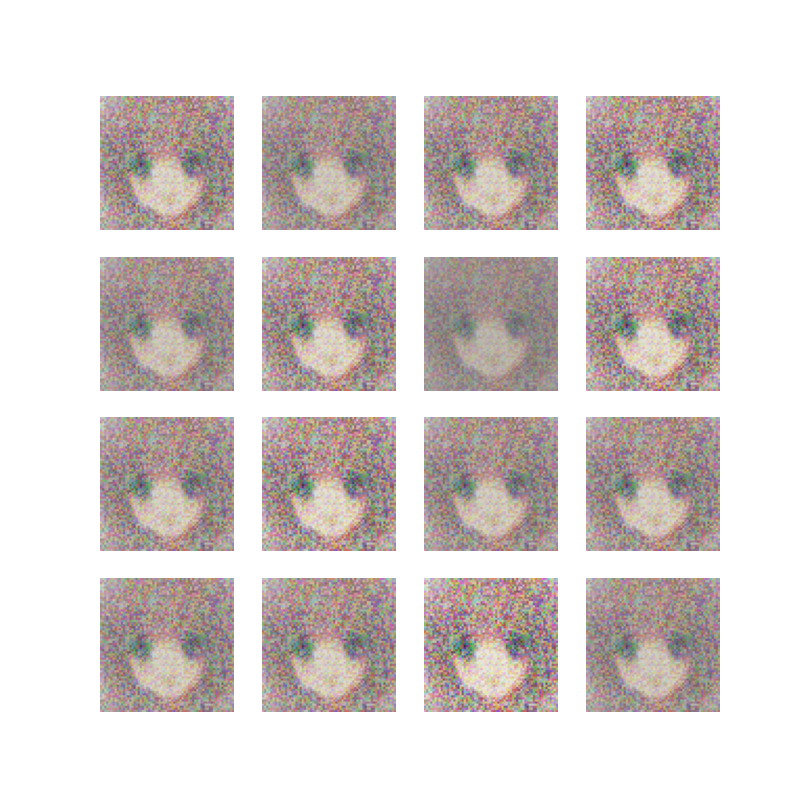
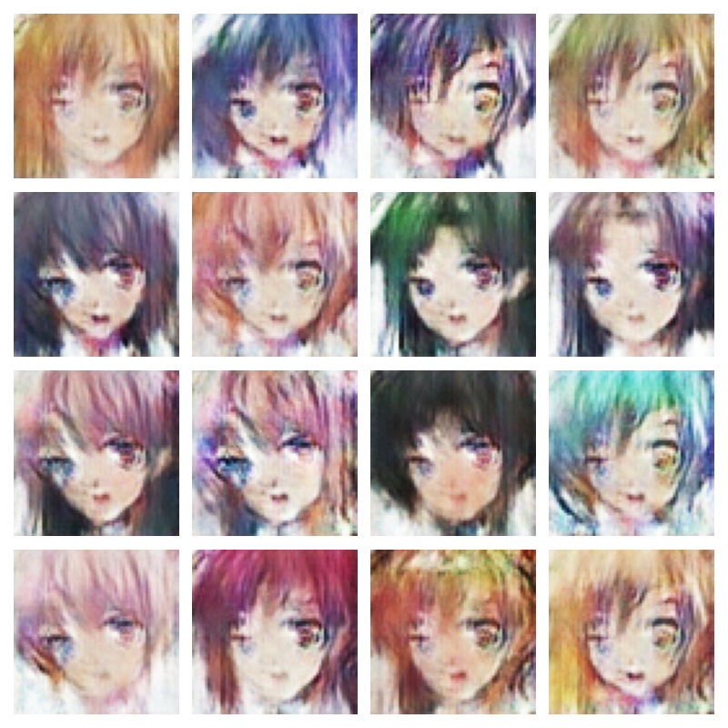
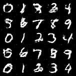
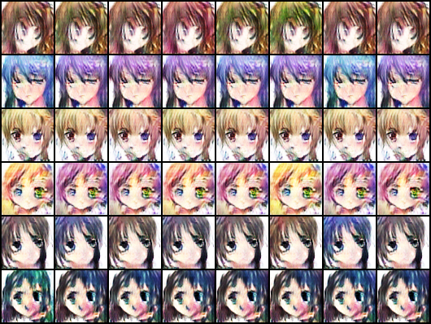
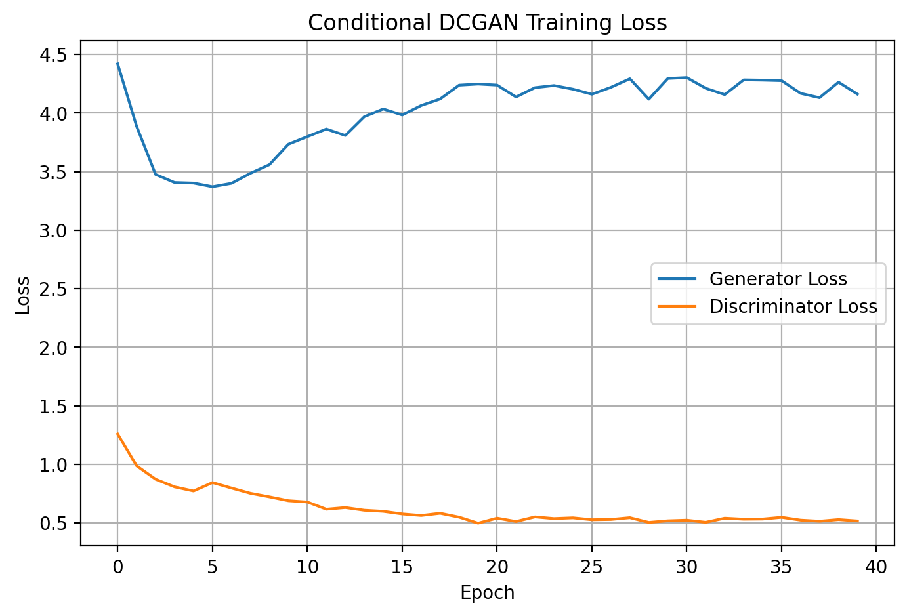

# Anime Character Generation using GANs

**Seasons of Code 2026 – IIT Bombay**

**Student:** Parakram Jangir (25B3926)
**Mentor:** Utkarsh Tanwar

---

## Project Overview

This project explores the fundamentals and practical implementation of **Generative Adversarial Networks (GANs)** for anime-style image generation.

The project begins with the theoretical foundations of GANs and gradually moves toward more advanced architectures, including **Vanilla GAN**, **Deep Convolutional GAN (DCGAN)**, and **Conditional GAN (cGAN)**.

The final stage focuses on extending anime face generation from unconditional GANs to a **Conditional DCGAN**, where label information is used along with random noise to generate anime faces in a more controlled way.

---

## Repository Structure

```text
Creating_anime_characters_with_GAN/
│
├── datasets/
│   ├── dataset_info.md
│   └── anime_faces_labelled/
│       └── labels.csv
│
├── docs/
│   ├── week-1.md
│   ├── week-2.md
│   ├── week-3.md
│   ├── week-4.md
│   └── week-5-7.md
│
├── results/
│   ├── vanilla_gan/
│   │   └── vanilla_gan_generated_samples.png
│   ├── dcgan/
│   │   └── dcgan_generated_samples.png
│   ├── cgan_mnist/
│   │   └── cgan_mnist_generated_samples.png
│   └── conditional_gan_anime_faces/
│       ├── week5_7_real_labelled_samples.png
│       ├── week5_7_final_samples.png
│       ├── week5_7_loss_curve.png
│       ├── epoch_001.png
│       ├── epoch_005.png
│       ├── epoch_010.png
│       ├── epoch_015.png
│       └── epoch_020.png
│       └── epoch_025.png
│       └── epoch_030.png
│       └── epoch_035.png
│       └── epoch_040.png
│
├── src/
│   ├── vanilla_gan/
│   │   └── vanilla_gan.ipynb
│   ├── dcgan/
│   │   └── dcgan.ipynb
│   ├── cgan_mnist/
│   │   └── cgan_mnist.ipynb
│   └── conditional_gan_anime_faces/
│       └── conditional_dcgan_anime_faces.ipynb
│
├── README.md
└── requirements.txt
```

---

## Weekly Progress

### Week 1 – GAN Fundamentals

* Studied the architecture of GANs
* Understood the Generator and Discriminator
* Learned adversarial training and minimax optimization
* Explored GAN variants including DCGAN, WGAN, CycleGAN, and StyleGAN

---

### Week 2 – Vanilla GAN

* Worked with the Anime Face Dataset
* Implemented a Vanilla GAN using PyTorch
* Trained the model to generate anime faces
* Studied GAN training behaviour and convergence

---

### Week 3 – Deep Convolutional GAN (DCGAN)

* Performed dataset preprocessing and normalization
* Implemented a Deep Convolutional GAN
* Compared DCGAN with Vanilla GAN
* Observed improvements in generated image quality and training stability

---

### Week 4 – Conditional GAN (cGAN)

* Studied Conditional GAN architecture
* Implemented a Conditional GAN using the MNIST dataset
* Learned label-conditioned image generation
* Understood how conditional information is incorporated into both the Generator and Discriminator
* Generated images conditioned on class labels

> **Note:** MNIST was used as a simple labelled dataset to understand Conditional GANs before applying similar concepts to anime face generation.

---

### Week 5-7 – Conditional DCGAN for Anime Faces

* Created a labelled version of the Anime Face Dataset
* Generated pseudo-labels using visual clustering because the original dataset did not contain predefined labels
* Loaded image-label pairs using a custom PyTorch Dataset
* Implemented a Conditional DCGAN for anime face generation
* Used label embeddings along with random noise in the Generator
* Used image-label conditioning in the Discriminator
* Trained the model on anime face images
* Saved generated samples across different epochs
* Plotted Generator and Discriminator loss curves
* Compared Conditional DCGAN results with earlier Vanilla GAN and DCGAN outputs

---

## Datasets

### Anime Face Dataset

Used for Vanilla GAN, DCGAN, and Conditional DCGAN experiments.

The dataset contains anime face images suitable for training image generation models. For the final Conditional DCGAN stage, pseudo-labels were created using visual clustering because the original dataset does not provide class labels.

### MNIST Dataset

Used for implementing and understanding Conditional GANs in Week 4.

---

## Technologies Used

* Python
* PyTorch
* NumPy
* Pandas
* Matplotlib
* OpenCV
* Scikit-learn
* Jupyter Notebook / Kaggle Notebook

---

## Results and Comparison

| Model             | Dataset                     | Conditioning | Output Type  | Observation                                          |
| ----------------- | --------------------------- | ------------ | ------------ | ---------------------------------------------------- |
| Vanilla GAN       | Anime Face Dataset          | No           | Anime faces  | Generated basic anime-like samples                   |
| DCGAN             | Anime Face Dataset          | No           | Anime faces  | Improved visual structure using convolutional layers |
| Conditional GAN   | MNIST                       | Yes          | Digit images | Demonstrated label-conditioned image generation      |
| Conditional DCGAN | Labelled Anime Face Dataset | Yes          | Anime faces  | Added label-based control to anime face generation   |

The final Conditional DCGAN successfully demonstrates the transition from unconditional anime face generation to conditional anime face generation. Some generated outputs may still contain blur or artifacts because GAN training is unstable and the labels used are pseudo-labels rather than manually verified semantic labels.

---

## Sample Outputs

### Vanilla GAN



### DCGAN



### Conditional GAN (MNIST)



### Conditional DCGAN Anime Faces



### Conditional DCGAN Loss Curve



---

## Limitations

* The Anime Face Dataset does not contain real semantic labels
* Pseudo-labels may not perfectly represent meaningful attributes
* GAN training is unstable and sensitive to hyperparameters
* Some generated images may be blurry or contain artifacts
* Longer training and better labels could improve generation quality

---

## Acknowledgements

This project was developed as part of **Seasons of Code 2026** at **IIT Bombay** under the guidance of **Utkarsh Tanwar**.
